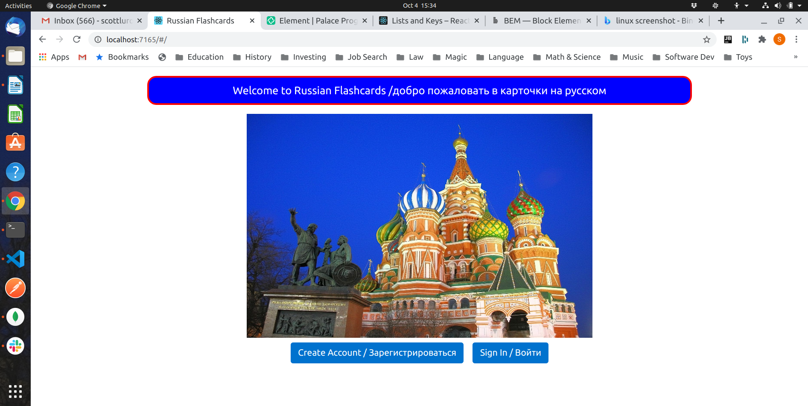
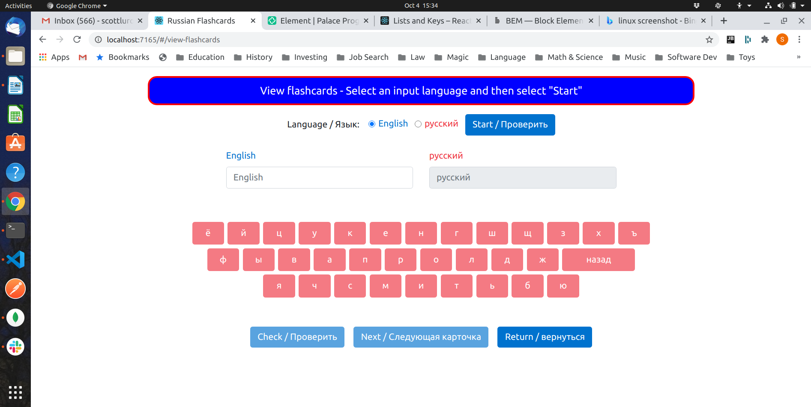
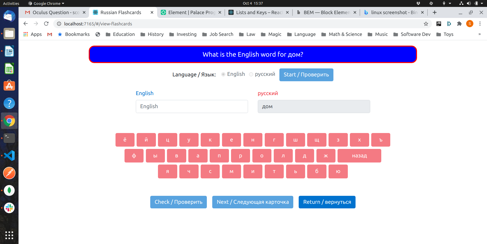
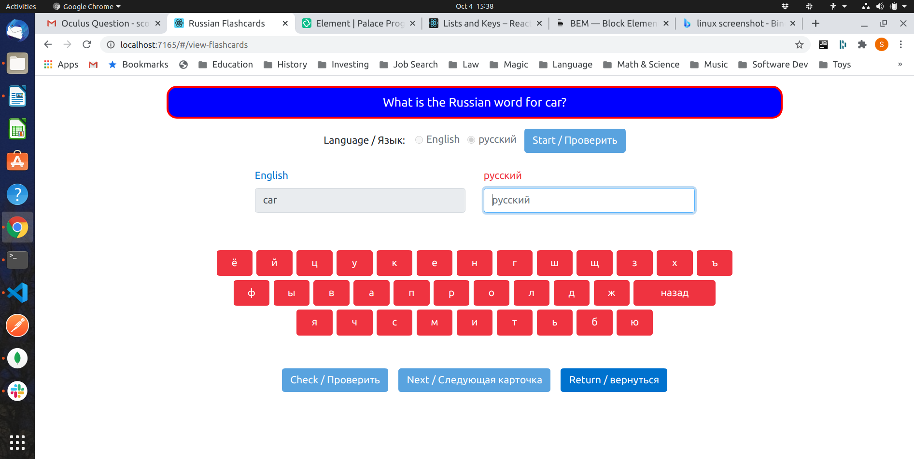
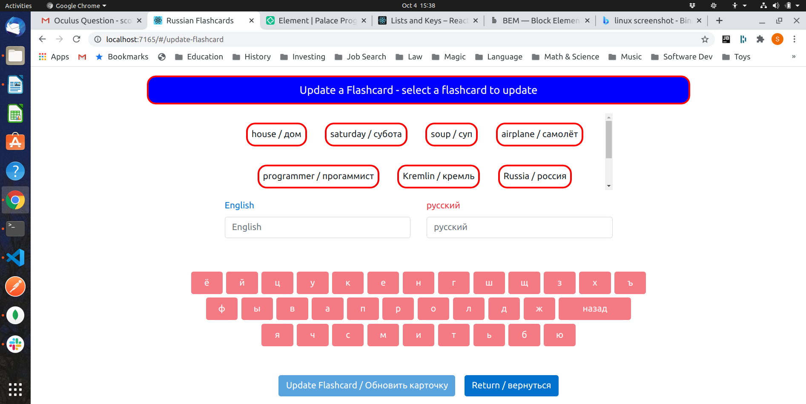

# Russian Flashcards React.js: Description

This project is a port of an web application that I wrote for 
[project 2](https://github.com/scottlurowist/russian_flashcards-web-app) of 
[General Assembly's SEI program](https://generalassemb.ly/education/software-engineering-immersive/new-york-city).
I chose to do Russian Flashcards because I speak Russian and have friends in Russia who
would like to use this app. I too shall use this app to build my vocabulary.

You may read about my design decisions for the plain vanilla JavaScript version of the application
at [project 2](https://github.com/scottlurowist/russian_flashcards-web-app). That app reflects
how I would build an app under those General Assembly requirements, based upon my knowledge
gained from a Masters in Computer Science and my real-world software development experience.

With this port, I am free to do things the way that I would want to do them using React.js
and React Bootstrap. Version 1 of this app will try to mimic the functionality of the 
[first version](https://github.com/scottlurowist/russian_flashcards-web-app) of 
Russian Flashcards so as to provide a contrast between a modern framework and a roll-your-own
approach.

For those wondering, I went with a red, white, and blue design because both the American and
Russian Federation flags are red, white, and blue. With this port, I chose the actual colors
of the Russian Federation flag as found here: 

https://flagcolor.com/russia-flag-colors/

I chose to port the project 2 app because:
1. I was not happy with my work in project #2. I knew that I could do better.
    * For example, buttons did not enable / disable as appropriate. 
    * The Cyrillic keyboard was duplicated in my code.
    * The Cyrillic keyboard did not enable and disable as appropriate.
    * Update and delete did not show things to update and delete. You had 
      to enter text into a search box and hope that you were correct.
    * Many other issues.  
2. I always need a project to learn something.
3. I saw how React could simplify the problems I had in project #2:
    * I wanted to have buttons and the Cyrillic keyboard enable and disable as appropriate. I would
      have needed to write a lot of logic to do that. React's one-way data binding made that work.
    * I didn't need to write a pseudo-state machine as I did in the orignal app because I could use
      React's router. This saved me some code.  
    * I didn't have to deal with a massive HTML file. Components let me focus on individual pieces
      of API.
4. I want my portfolio to have a project for which I took different approaches:
    * The first version of Russian Flashcards shows how I thought when I had four days to write
      an app using vanilla JS, CSS, and HTML. It shows that without tools such as React or Angular,
      that I could build my own MVC-style framework.
    * The port shows how I think with a modern front-end framework.   

I think that I am mostly pleased with the port. There are issues to resolve and things that I shall do
better, but I hit the deadline for resubmittal and frankly ran out of gas. I think it is superior in many ways to the original.
  * You cannot type English into the Russian input fields, as well as the converse.
  * The Cyrillic soft keyboard is only enabled when appropriate.
  * Buttons enable and disable as appropriate.
  * Update and delete no longer require a search. It was easy with React.js to make  visual"flashcards". Just by clicking them they populate the input fields. When you edit the text, those same flashcards update.     
  * I believe that a UI should never setup a user for failure. I think that I succeeded.       

One twist on the flashcards in the original and this app is that it is requires typing. I know
as a language learning enthusiast that learning a language involves using as many senses as you can.
So I require users to type either English or Russian rather than simply "flipping a card". Perhaps 
a future version will require typing and then do the flipping for extra visual impact.

Future versions will be much more visually appealing and functiional.

The application communicates with a backend web API implemented with Express.js,
Mongoose.js, MongoDB, and of course Node.js. I implemented the backend and it is deployed to Heroku.
This was done for [the first version](https://github.com/scottlurowist/russian_flashcards-web-app)
of the original app. That code may be found here:
[Russian Flashcards Web API](https://github.com/scottlurowist/russian-flashcards-webapi-server).
This code may be expanded in the future as the Russian Flashcards React app grows.

***

### Technologies Directly Used

- JavaScript, SCSS (including Flexbox)
- React.js using JSX, React Router, React Bootstrap, Axios for web service invocations.
- React.js scaffolding using "create-react-app"

***

### Unsolved Problems

- I have no usolved problems based upon the requirements I gave to myself.

***

### Nice-to-haves / Technical Debt
* Improve the styling.
* Improve the messages. Have dual English and Russian messages.
* Make the app more bilinqual. It is currently biased towards English. 
* Create a React Native port of the app.
* Eliminate magic numbers and strings.
* Make the flashcards in the update and delete view its own component.
* The Cyrillic keyboard took a callback and returned a single character. Late in the game
  I realized that I did not have a backspace character so I added that. The result is duplicated
  code in parent callbacks that have to do the work of adding and removing characters to
  state. The keyboard should take a parameter with the string to which to append or remove 
  characters and return the string, not a character, via the callback.
* The Update component will actually let you create a flashcard. This will be fixed.  
* Write Jest tests.
* Add more visual appeal.
* Add support for synonyms. The current version requires exact one-to-one textual matches.
  Future versions could have many Russian words for many English words.
    * For example, машина could be car and it could be automobile.
* "Shuffle" the flashcards. Currently the presentation order is always the same.
* Add the ability to add weights to the card. If you are comfortable with a card,
  it will be shown to you less frequently.
***

### Screenshots:

